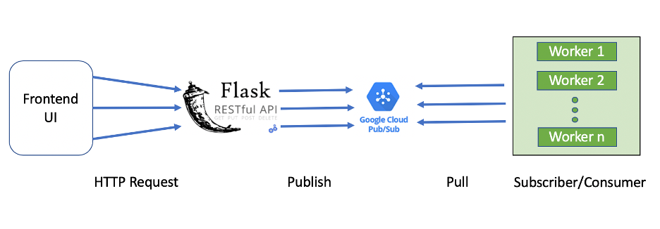

## A generic framework of concurrent consumers for Google Cloud Platform Pub/Sub

An example shows how to publish messages to Pub/Sub and build a service to consume the messages concurrently using the Python multiprocessing module

https://towardsdatascience.com/a-python-implementation-of-concurrent-consumers-for-google-cloud-platform-pub-sub-991ae8b9841d

